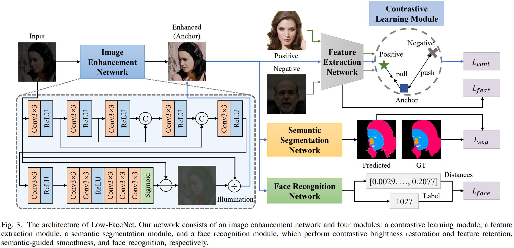

# Low-FaceNet: Face Recognition-Driven Low-Light Image Enhancement

This repo is the official implementation of "Low-FaceNet: Face Recognition-Driven Low-Light Image Enhancement". 

> **Abstract:**
>
> Images captured in low-light conditions often induce the performance degradation of cutting-edge face recognition models. The missing and wrong face recognition inevitably makes vision-based systems operate poorly. In this paper, we propose Low-FaceNet, a novel face recognition-driven network to make low-level image enhancement (LLE) interact with high-level recognition for realizing mutual gain under a unified deep learning framework. Unlike existing methods, Low-FaceNet uniquely brightens real-world images by unsupervised contrastive learning and absorbs the wisdom of facial understanding. Low-FaceNet possesses an image enhancement network that is assembled by four key modules: a contrastive learning module, a feature extraction module, a semantic segmentation module, and a face recognition module. These modules enable Low-FaceNet to not only improve the brightness contrast and retain features but also increase the accuracy of recognizing faces in low-light conditions. Furthermore, we establish a new dataset of low-light face images called LaPa-Face. It includes detailed annotations with 11 categories of facial features and identity labels. Extensive experiments demonstrate our superiority against state-of-the-art methods of both LLE and face recognition even without ground-truth image labels. 




## 📣News

- Oct 19, 2023: Released datasets, pre-trained models, testing, and evaluation codes.

- Feb 2, 2024:  Our research paper has been accepted for publication in IEEE Transactions on Instrumentation and Measurement (TIM). 

- Mar 23, 2024: The paper is now available at [IEEE Early Access](https://ieeexplore.ieee.org/document/10476748).

- Mar 30, 2024: Released the training code.

  

## 💻Getting Started

### Environment

Clone this repo:

```
git clone https://github.com/fanyihua0309/Low-FaceNet.git
cd Low-FaceNet/
```

Create a new conda environment and install dependencies:

```
conda create -n low-facenet python=3.7
conda activate low-facenet
conda install pytorch==1.13.0 torchvision==0.14.0 torchaudio==0.13.0 pytorch-cuda=11.7 -c pytorch -c nvidia
pip install -r requirements.txt
```


### Prepare Pre-trained Models

You can download the pre-trained models from [Google Drive](https://drive.google.com/drive/folders/1YNpVyA3zsSQ8ns2CfwqXU3A_S7Doj9TF?usp=sharing) or [BaiduNetdisk](https://pan.baidu.com/s/18RD-XVuVjFQJEi3MmjsYBw?pwd=7244).

More detailed descriptions of the pre-trained models are listed below:

| Name                                          | Description                                | Usage                               |
| --------------------------------------------- | ------------------------------------------ | ----------------------------------- |
| best_deeplabv3plus_mobilenet_lapa_epoch96.pth | Pre-trained semantic segmentation model    | For training                        |
| Retinaface_mobilenet0.25.pth                  | Pre-trained face detection model           | For training and evaluation         |
| facenet_mobilenet.pth                         | Pre-trained face recognition model         | For training and evaluation         |
| unique.pt                                     | Pre-trained unique model                   | For evaluation of the UNIQUE metric |
| Low-FaceNet.pth                               | Pre-trained the proposed Low-FaceNet model | For evaluation                      |


### Prepare Datasets

You can download the datasets from [Google Drive](https://drive.google.com/drive/folders/1PHpYURYWxeFlnWABTSeXkEimNi2by7Dc?usp=sharing) or [BaiduNetdisk](https://pan.baidu.com/s/17TS_C3iC70eFsvKAuSuXtA?pwd=l38q).

More detailed descriptions of the datasets are listed below:

| Usage | Name        | Total   | Individual |
| ----- | ----------- | ------- | ---------- |
| Train | LaPa-Face   | 4000    | 2185       |
| Train | Contrast    | 360/360 | 360        |
| Test  | CASIA-Test  | 500     | 100        |
| Test  | LaPa-Test   | 1789    | 1313       |
| Test  | LFW         | 13233   | 5749       |
| Test  | CelebA-Test | 1000    | 1000       |

 Make sure the file structure is consistent with the following:

```python
┬─ checkpoint
│   ├─ best_deeplabv3plus_mobilenet_lapa_epoch96.pth
│   ├─ facenet_mobilenet.pth
│   ├─ Low-FaceNet.pth
│   ├─ Retinaface_mobilenet0.25.pth
│   └─ unique.pt
└─ dataset
    ├─ CASIA-Test
    ├─ CelebA-Test
    ├─ Contrast
    ├─ LaPa-Face
    ├─ LaPa-Test
    └─ LFW
```


### Train

Run the following script to train the model: 

```
python train.py
```

By default, the weight files will be saved in `checkpoint/LLE/`.

Please note that before the first training of our model,  it will take a little while to establish the corresponding face database and generate the corresponding face encodings. They will be saved in `database/` and `encoding/`, respectively.


### Test

Run the following script to obtain the enhanced results: 

```
python test.py
```

You can change the default settings by: 

```
python test.py --underexposed_path=dataset/CASIA-Test/underexposed --enhanced_path=dataset/CASIA-Test/enhanced --enhance_checkpoint=checkpoint/Low-FaceNet.pth
```


### Evaluate

Make sure you have already saved the corresponding enhanced images.

Run the following script to evaluate the pre-trained model: 

```
python eval.py
```

You can change the dataset to be evaluated by: 

```
python eval.py --dataset_name=CASIA-Test
```

Please note that before the first evaluation of face recognition performance,  it will take a little while to establish the corresponding face database and generate the corresponding face encodings. They will be saved in `database/` and `encoding/`, respectively.


## 📧Contact

 If you have any questions or suggestions about our paper and repo, please feel free to concat us via fanyihua@nuaa.edu.cn.